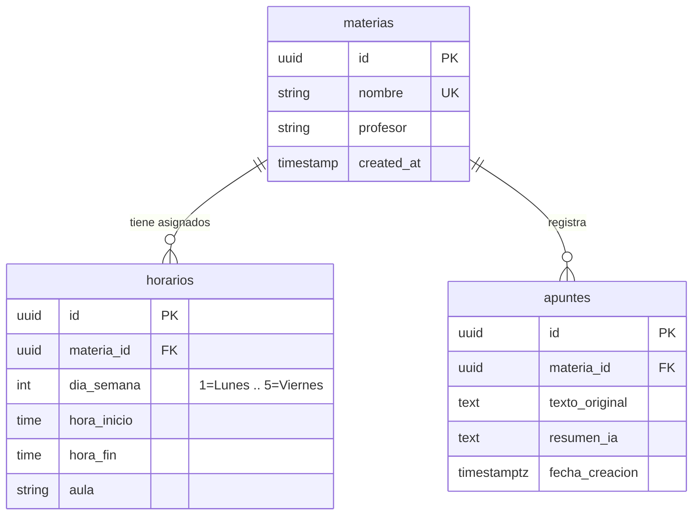
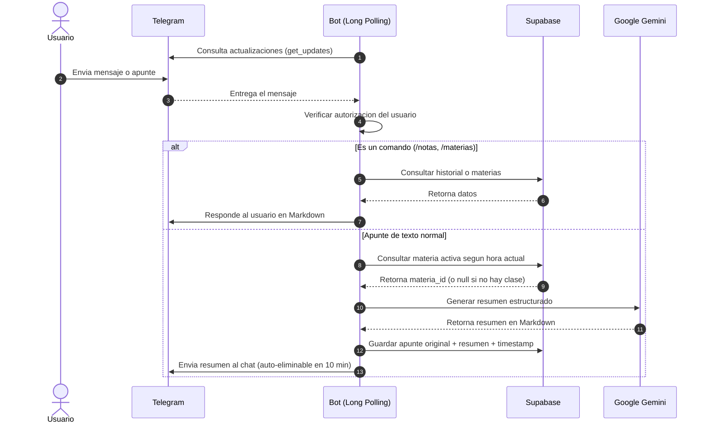

# Suminder - Asistente Academico en Telegram

**Suminder** es un backend automatizado que funciona como asistente de estudio integrado con Telegram, Google Gemini y Supabase.

---

## Objetivo

El proyecto resuelve el problema de capturar y organizar apuntes durante las horas de clase:

1. **Procesamiento de apuntes:** Al enviar notas de clase por Telegram, el bot detecta automaticamente que materia esta en curso segun el horario guardado en la base de datos, genera un resumen estructurado con IA y lo almacena con marca de tiempo.
2. **Consultas por chat:** Permite recuperar resumenes pasados por materia mediante comandos directamente en Telegram.
3. **Recordatorios de horario:** Envia alertas automaticas al inicio y fin de cada clase segun el horario configurado.

---

## Stack Tecnologico

| Componente | Tecnologia | Descripcion |
| :--- | :--- | :--- |
| **Lenguaje** | Python 3.11+ | Soporte nativo para programacion asincrona. |
| **Bot** | python-telegram-bot | Long Polling nativo, sin necesidad de URLs publicas. |
| **Base de datos** | Supabase (PostgreSQL) | BD relacional en la nube con soporte para fechas y zonas horarias. |
| **IA / Resumenes** | Google Gemini | Generacion de resumenes estructurados a partir de notas de texto. |
| **Despliegue** | Render | Hospedaje del proceso backend en la nube. |

---

## Esquema de la Base de Datos

El modelo relacional esta compuesto por 3 tablas:



> [!IMPORTANT]
> RLS (Row Level Security) esta activo en las 3 tablas. El backend opera unicamente mediante `SUPABASE_SERVICE_ROLE_KEY`.

---

## Estructura del Proyecto

```plaintext
Suminder/
├── .env                        # Variables secretas (excluido del repositorio)
├── requirements.txt            # Dependencias del proyecto
├── config.py                   # Centralizador de variables de entorno
├── database.py                 # Inicializacion del cliente de Supabase
├── main.py                     # Punto de entrada, inicializa el bot y los handlers
└── services/
    ├── telegram_service.py     # Handlers de comandos y mensajes de Telegram
    ├── ai_service.py           # Integracion con Google Gemini
    ├── database_service.py     # Consultas a Supabase
    └── schedule.py             # Servicio de recordatorios de horario en segundo plano
```

---

## Flujo de Ejecucion



---

## Variables de Entorno (.env)

```ini
TELEGRAM_BOT_TOKEN=tu_bot_token_aqui
TELEGRAM_USER_ID=tu_user_id_numerico
GEMINI_API_KEY=tu_gemini_api_key
SUPABASE_URL=https://tu-proyecto.supabase.co
SUPABASE_SERVICE_ROLE_KEY=tu_service_role_key
TIMEZONE=America/Managua
```

---

## Ejecucion Local

```bash
# Instalar dependencias
pip install -r requirements.txt

# Ejecutar el bot
python main.py
```

No se requiere configurar webhooks ni URLs publicas para desarrollo local.